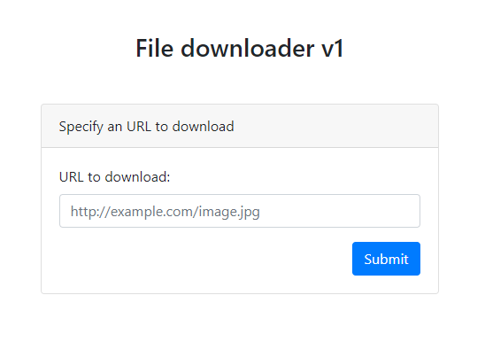

# ENISA Hackfest 2020: downloader-v1

  
  


## Description
Don't you find it frustrating when you have uploaded some files on a website but you're are not sure if the download button works? Me neither. But some people did. Is there even demand for such a service?

## Summary
Improper user input sanitization allows as to perform at LFI attack and obtain the flag.

## Flag
```
DCTF{6789af26f90396678909a99bf46ba3a78b2f1b349fbc4385e6c50556c1d0c9ff}
```

## Detailed solution

First visiting the provided URL, we are greeted with the following form:



Entering the URL of an image has the following result:


Here we can see that it performs the following operations, showing us the results:

1. It `cd`'s into a new directory, the path of which, upon multiple trials, looks to be time-based and unique every time,
2. It runs `wget` against the provided URL,
3. Removes all files matching any of the `php,pht,phtml,php4,php5,php6,php7` extensions from the directory.

First thing we can try is whether the input gets sanitized before passed to wget. Here we'll be trying to pass some extra parameters to `wget`.


Surely enough, we can control `wget`'s parameters. That allows us to perform an LFI attack using the `--post-file` argument, when using a URL where we can see the requests. In this case we are going to use requestbin.


Displaying the source of the web page, reveals the existance of a `flag.php` file.


But trying to open it on the browser proves pointless as it only displays a `GET ME!` message.


On the other hand, trying to post the file to our requestbin server, should give us the flag.


but there seems to be a check in place for the `flag.php` string.

Turns out we can bypass this by having out request not end with `flag.txt`.


