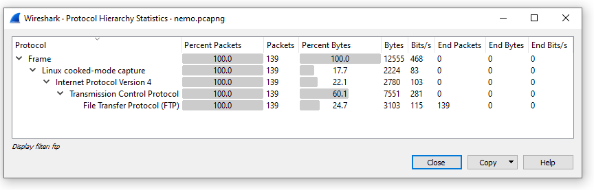
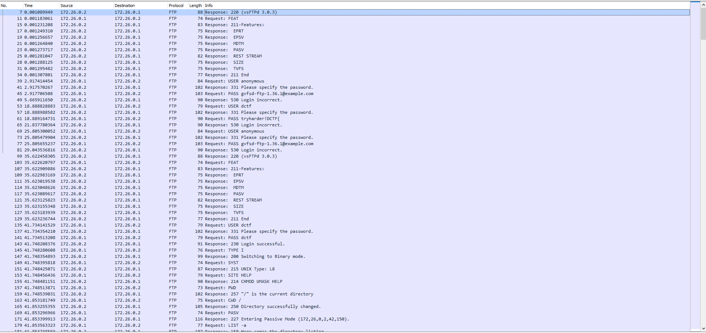
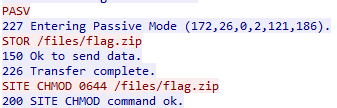
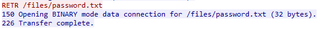
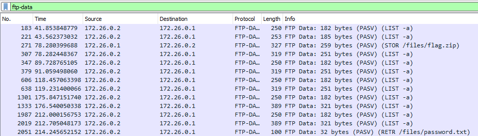
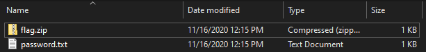
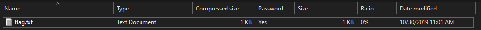
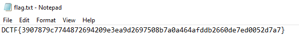

# ENISA Hackfest 2020: hello-nemo

  
  


## Description
We just managed to intercept Cpt. Nemo of the Nautilus submarine. Something's fishy over here...

Download `nemo.pcapng` and start the investigation.

## Attached files
- [nemo.pcapng](nemo.pcapng)

## Summary
A `.pcapng` file with some cleartext FTP traffic from which we can extract a zip file and a text file. Using the password from the txt file to unlock the zip file's contents gives us the flag.

## Flag
```
DCTF{3907879c7744872694209e3ea9d2697508b7a0a464afddb2660de7ed0052d7a7}
```

## Detailed solution

After opening the `nemo.pcapng` file and checking the Protocol Hierarchy Statistics:



our attention is driven to the FTP traffic in the file.



Here, we can see a user trying to connect to an FTP server. Then they upload `flag.zip`:



and download `password.txt`:



We can retreive both files from the FTP-DATA packets.





Inside `flag.zip` is a `flag.txt` file, which is password protected.



Using the password from the `password.txt` file, gives us the flag.


