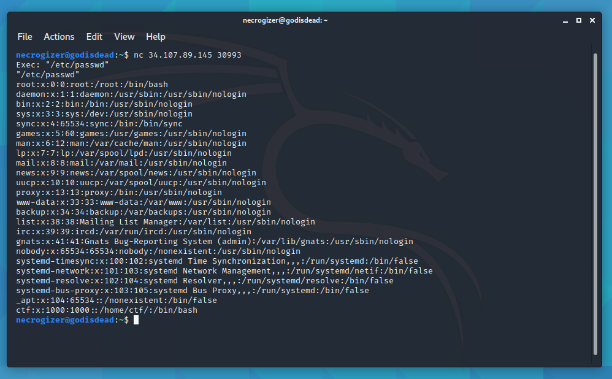
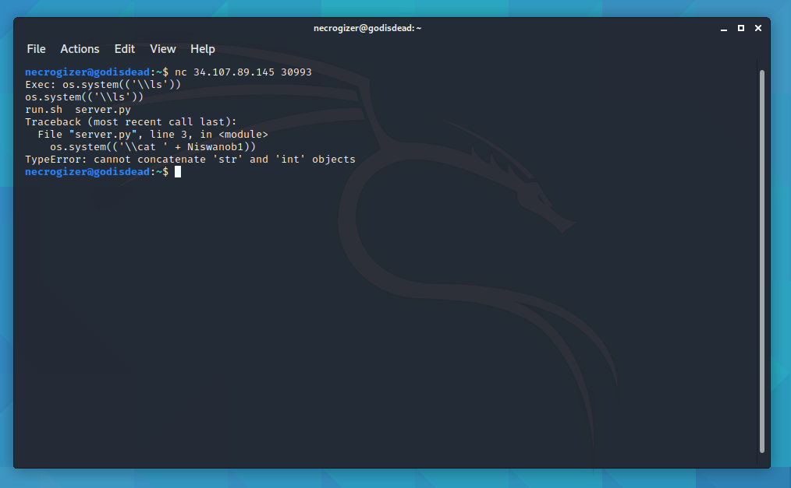
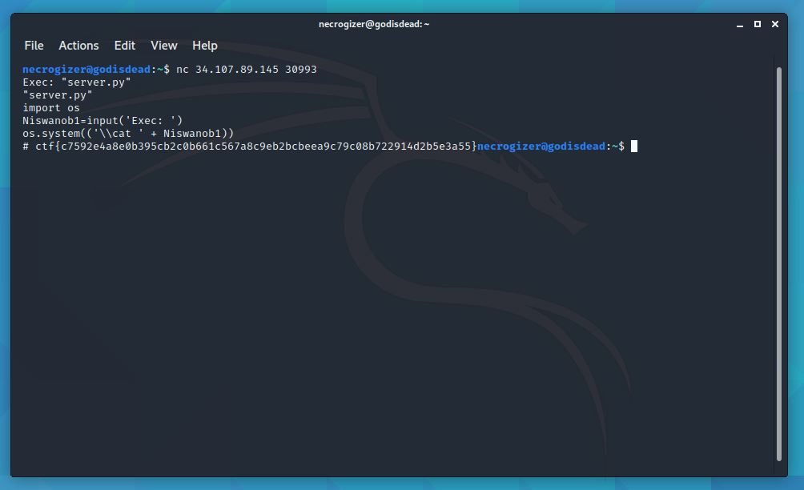

# ENISA Hackfest 2020: warmup-cat

  
  


## Description
https://imgur.com/a/NAuGuop os.system(('\\cat ' + user_input_olddie_eol))

## Summary
A network service allowing us to `cat` any file we wish, but without proper input validation, we can also run anything we want, which ultimately allows us to get the flag.

## Flag
```
ctf{c7592e4a8e0b395cb2c0b661c567a8c9eb2bcbeea9c79c08b722914d2b5e3a55}
```

## Detailed solution

As hinted by the challenge description, opening a connection to the given ip:port, allows us to pass parameters to the `os.system(('\\cat ' + user_input_olddie_eol))` command.

This allows us to perform an LFI attack.



Unfortunatelly we also need to run an `ls` command to see what we can get so in order to do that we can pass `os.system(('\\ls'))` as a parameter, which will evaluate to running the `ls` command against the system and then trying to pass is to `cat` (which, of course, will fail).



Passing `"server.py"` as a parameter to `os.system(('\\cat ' + user_input_olddie_eol))`, will give us the contents of the file and also the flag, which turns out to be a comment on the file.


