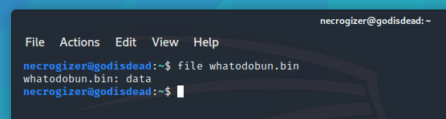
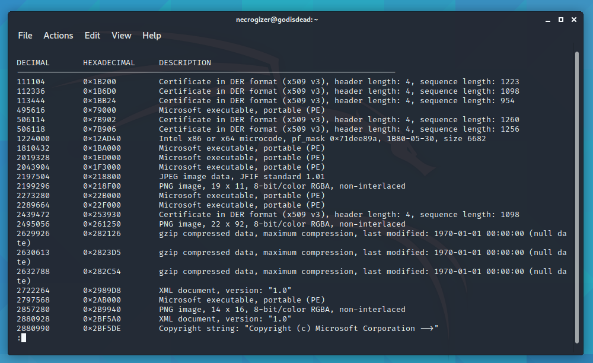
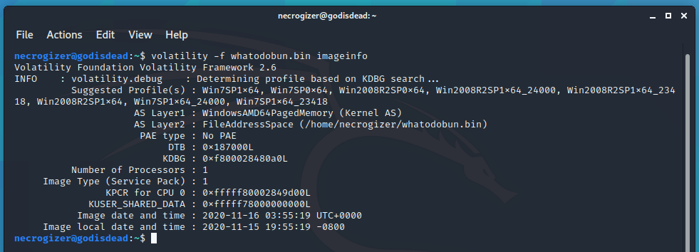
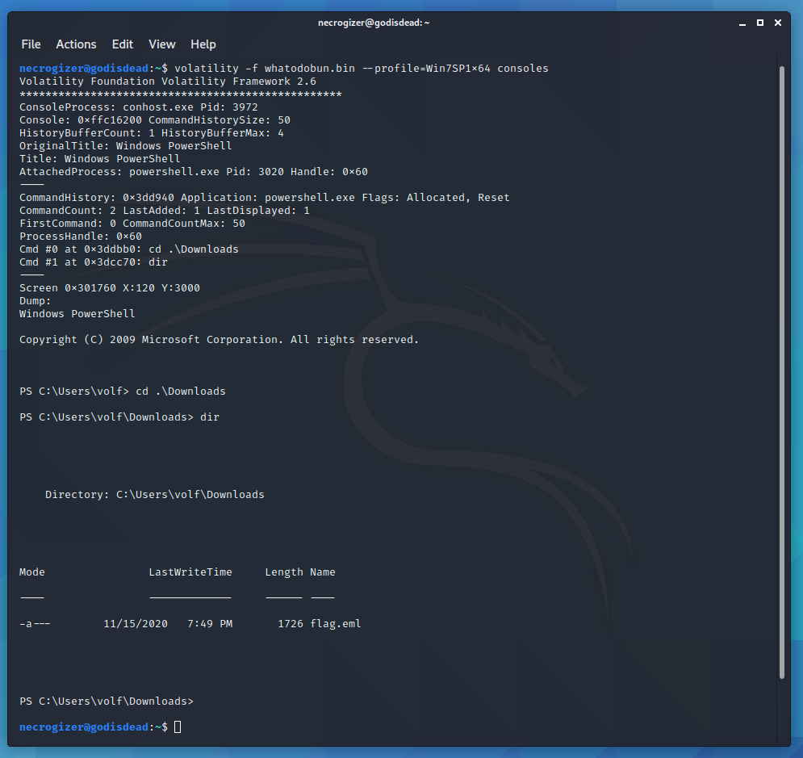
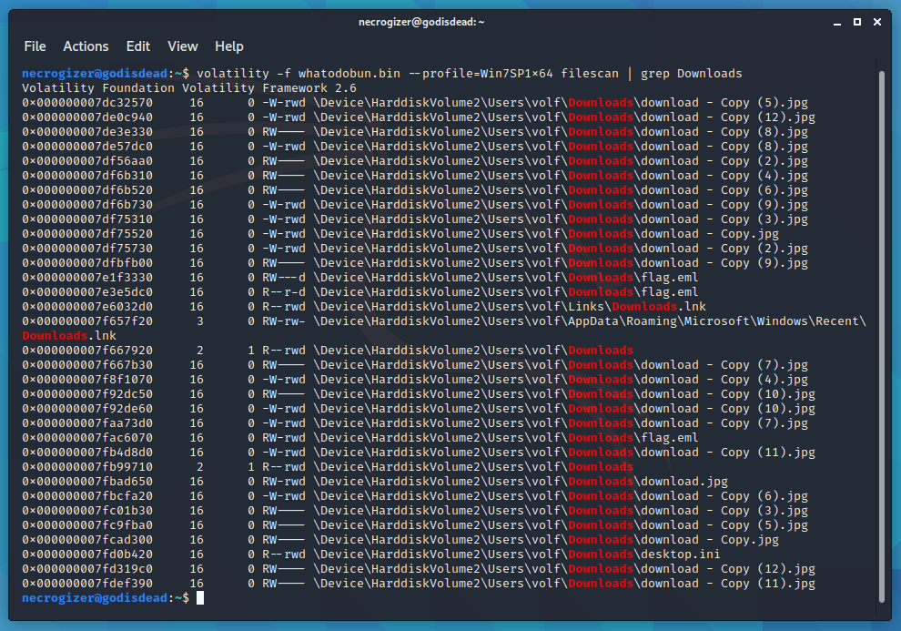
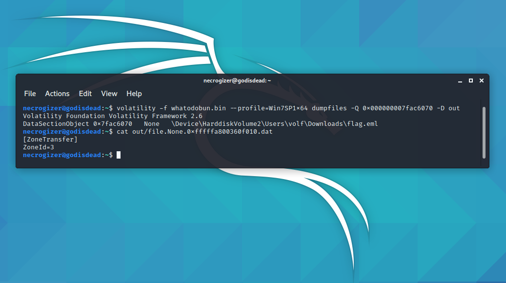
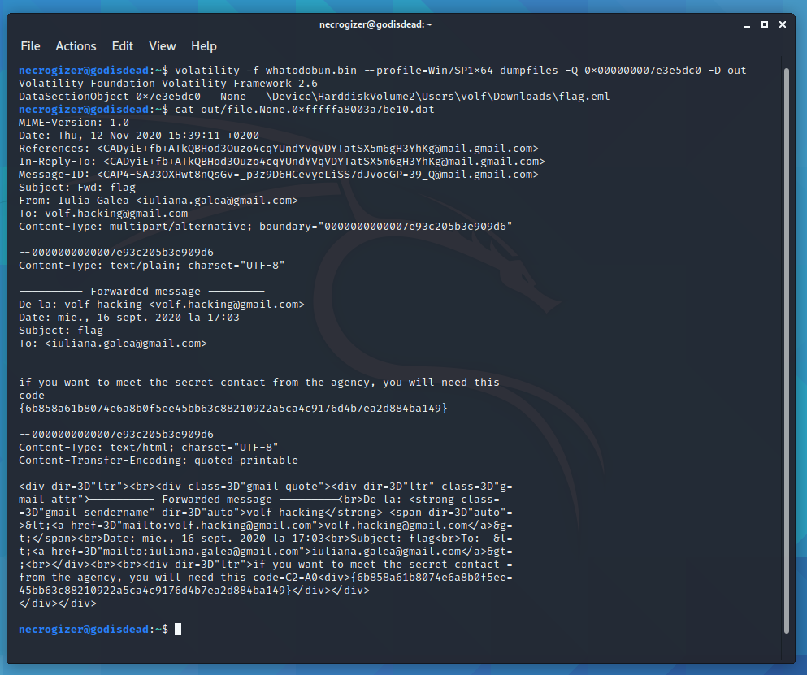

# ENISA Hackfest 2020: what-to-do

  
  


## Description
We have received an anonymous call with the following message: “There was a critical information leakage, an attacker managed to read our emails without internet connection...all we have is this file”

## Summary
A memory dump containing a saved email with the flag on it.

## Flag
```
CTF{6b858a61b8074e6a8b0f5ee45bb63c88210922a5ca4c9176d4b7ea2d884ba149}
```

## Detailed solution

Extracting the bin file and running `file` against it doesn’t give us a lot of information about it.



On the other hand, binwalk reveals a lot of Windows related files.



For that reason, it might be worth to give volatility a try.



Which sure enough reveals it’s a Windows 7 or Windows 2008 Memory Dump.

First things first, we check for any interesting running programs, last used commands etc.



Running `volatility -f whatodobun.bin --profile=Win7SP1x64 consoles` reveals there was a flag.eml file on the `C:\Users\volf\Downloads` directory. Let’s try to find it.



`volatility -f whatodobun.bin --profile=Win7SP1x64 filescan | grep Downloads` gives us the files in that directory.

There are multiple entries for flag.eml, one of them being an alternative data stream not containing any useful information for us.



Dumping the right entry of flag.eml, gives us the contents of an email containing the flag.


